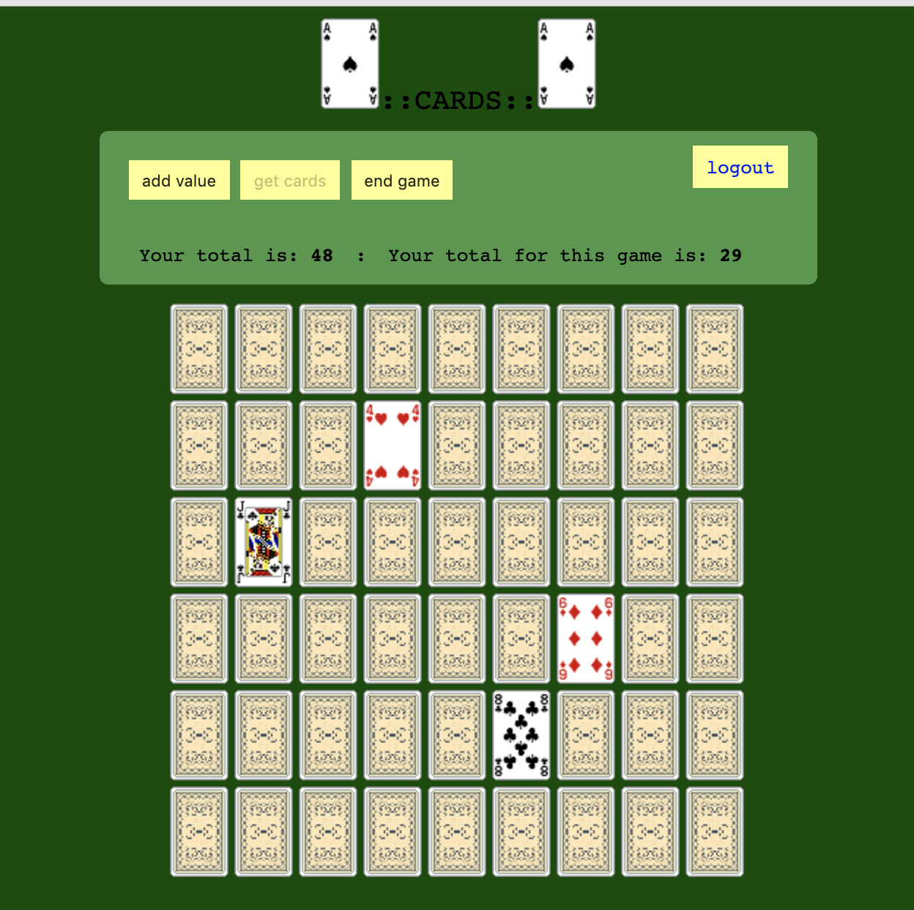

# CARDS



### requirements:

###### php

Mac Os: `/usr/bin/php -S localhost:8000`

[mac os preinstalled PHP](https://medium.com/@romaninsh/install-php-7-2-on-macos-high-sierra-with-homebrew-bdc4d1b04ea6)

Otherwise, install php and run apache from the root of this repo.

###### redis

[Install redis with brew](https://gist.github.com/tomysmile/1b8a321e7c58499ef9f9441b2faa0aa8)

```bash
redis-server /usr/local/etc/redis.conf
```

### Run

Goto [http://localhost:8000](http://localhost:8000)

